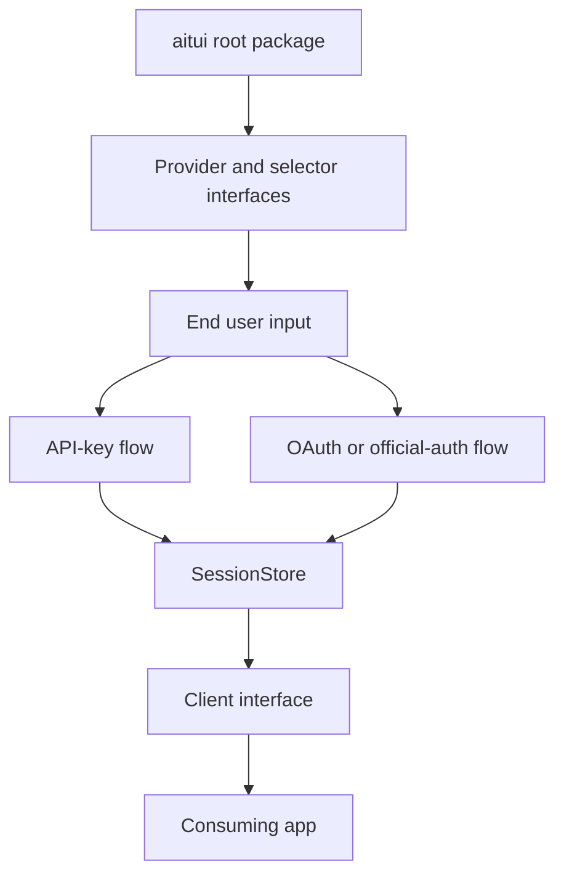

# Architecture

`aitui` is a Go library for command-line applications that want to offer AI-backed features through one stable interface. The architecture follows the same path the user experiences: the root package exposes provider and selector interfaces, the selector gathers end user input, the selected provider runs either an API-key flow or an OAuth or official-auth flow, session state is prepared, a `Client` is returned, and the consuming app uses that client.

The first version is intentionally modest: provider selection, provider setup checks, session preparation, and single-turn chat. It is not a terminal chat application, a streaming UI toolkit, or a credential manager.

## Overview

The root package does not choose a backend by itself. It defines the contracts and selection flow that let a consuming app offer providers, ask the end user which provider to use when needed, prepare the selected provider, and receive a ready `Client`.

## Root Package

The root package is the stable entry point for downstream CLIs. It owns the public request and response types, provider and selector interfaces, shared errors, and the orchestration that turns a provider choice into a usable client.

The root package should stay provider-neutral. It should not know how a given HTTP request is encoded, how an OAuth login works, how an official CLI stores its own auth state, or how a selector UI is rendered.

## Provider And Selector Interfaces

The provider interface describes a backend that can report availability, prepare its auth or setup flow, and create a `Client`. Provider implementations hide backend-specific behavior behind this interface so downstream CLIs can depend on `aitui` instead of provider internals.

The selector interface describes how to choose one available provider. A selector can be interactive, configuration-driven, or non-interactive. Its job is to collect the end user choice and return the selected provider ID to the root flow.

## End User Input

End user input is the point where the selected auth path is chosen or completed. The user may choose a provider, enter an API key, confirm an existing provider configuration, or start an OAuth or official-auth login flow.

The consuming app still owns its command, flags, prompts, and persistence decisions. `aitui` only coordinates the reusable provider-selection and provider-preparation path.

## API-Key Flow

For now, an API-key flow always receives the key from end user input during provider setup.

`aitui` must not persist raw API keys. The API-key flow may receive the key, validate that it is present, and pass it into request setup for the selected client.

API-key providers should support fake transports, test base URLs, and deterministic request construction so default tests never make live provider calls.

## OAuth Or Official-Auth Flow

An OAuth or official-auth flow uses a provider-supported login mechanism instead of an API key. The provider may use an OAuth exchange, an official CLI, or another supported harness.

`aitui` must not scrape browser sessions, read private credential stores, copy refresh tokens, or convert subscription login state into API keys. Provider-owned tokens and sessions stay with the provider-supported auth mechanism.

OAuth or official-auth providers should make command execution and setup predictable with explicit arguments, bounded contexts, captured stderr, and errors that explain what failed without exposing secrets.

## SessionStore

`SessionStore` sits after the selected auth flow and before client creation. It exists to keep non-secret state needed to make a prepared provider reusable between commands.

For an API-key flow, `SessionStore` may remember non-secret choices such as the selected provider ID, selected model, or that setup has already been completed. It must not store the API key.

For an OAuth or official-auth flow, `SessionStore` may remember non-secret continuity data such as a selected account alias, profile name, provider-specific conversation handle, or setup marker. It must not store access tokens, refresh tokens, browser sessions, or official-tool private auth files.

## Client Interface

The client interface is the result of successful selection and setup. It gives the consuming app one stable way to send a single chat request without knowing which provider or auth path produced the client.

Provider adapters translate `ChatRequest` into backend-specific calls and translate provider responses back into `ChatResponse`. Errors should be clear enough for downstream CLIs to show to users and safe enough that secrets are never printed.

## Consuming App

The consuming app receives the `Client` and owns the command behavior around it: building prompts, deciding when to call AI, displaying output, configuring providers, and deciding whether any user-owned credentials should be remembered outside `aitui`.

This boundary keeps `aitui` reusable. The library handles provider selection and client creation, while the consuming app remains responsible for its product experience and any persistence policy it wants to offer.
